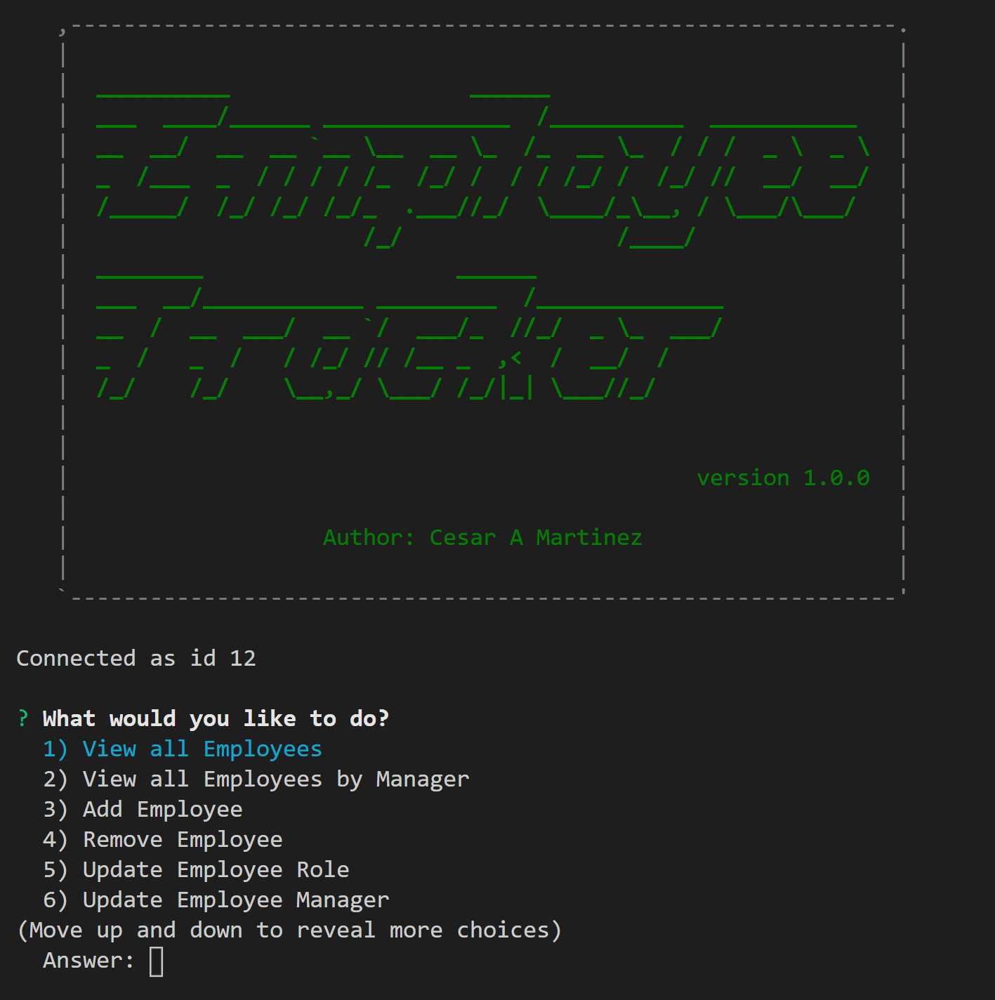
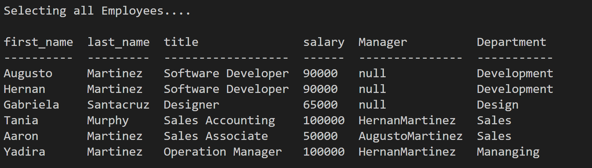
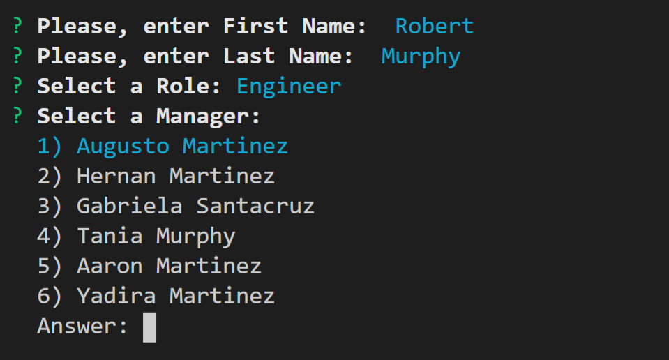
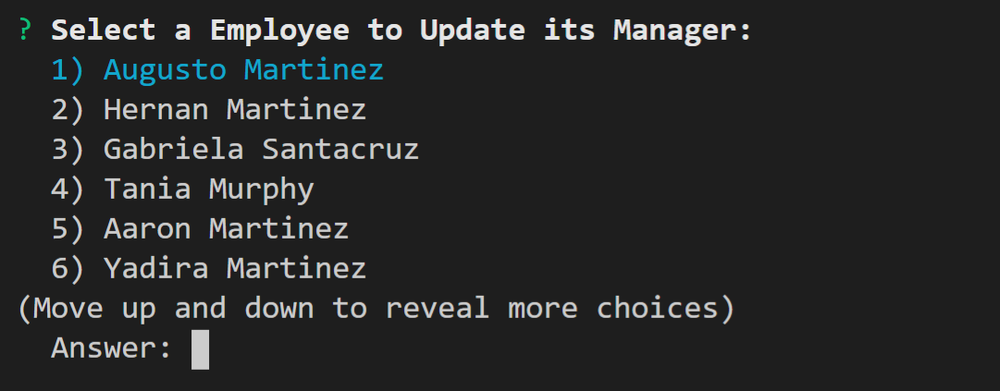
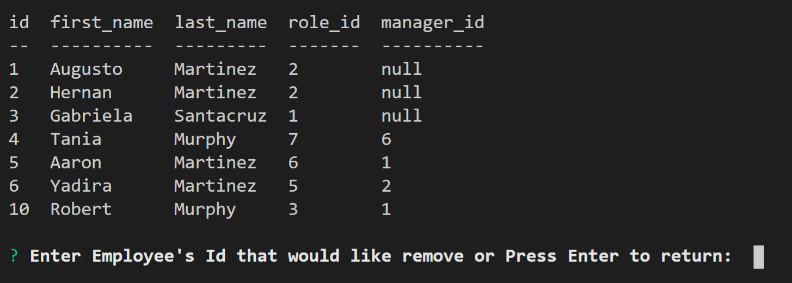

# Employee_Tracker


Links : [Video](https://afternoon-island-56967.herokuapp.com/), [Repository](https://github.com/CesarAugustoMartinez/Employee_Tracker)

---

### Table of Contents

- [Description](#description)
- [How to Use](#how-to-use)
- [Screenshots](#screenshots)
- [References](#references)
- [License](#license)
- [Author Info](#author-info)

---

## Description

The goal of this project is to architect and build a solution for managing a company's employees using node, inquirer, and MySQL.The app allows the user to:

  * Add departments, roles, employees

  * View departments, roles, employees

  * Update employee roles

  * Update employee managers

  * View employees by manager

  * Delete departments, roles, and employees

  * View the total utilized budget of a department


#### Technologies

- JavaScript
- NPM Modules
- Visual Studio Code
- Node.js
- Package.json
- MySQL

##### Code sample - JavaScript - Connection to a Databse 
#

```js
var mysql = require("mysql");

// create the connection information for the sql database
var connection = mysql.createConnection({
  host: "localhost",

  // Your port; if not 3306
  port: 3306,

  // Your username
  user: "root",

  // Your password
  password: "*********",
  database: "employee_tracker_db"
});


module.exports = connection;


```
##### Code sample - package.json
#
```json
 {
  "name": "employee_tracker",
  "version": "1.0.0",
  "description": "This app allows to view and manage the departments, roles, and employees in a company",
  "main": "index.js",
  "scripts": {
    "test": "echo \"Error: no test specified\" && exit 1"
  },
  "repository": {
    "type": "git",
    "url": "git+https://github.com/CesarAugustoMartinez/Employee_Tracker.git"
  },
  "author": "Cesar A Martinez",
  "license": "ISC",
  "bugs": {
    "url": "https://github.com/CesarAugustoMartinez/Employee_Tracker/issues"
  },
  "homepage": "https://github.com/CesarAugustoMartinez/Employee_Tracker#readme",
  "dependencies": {
    "asciiart-logo": "^0.2.6",
    "console.table": "^0.10.0",
    "inquirer": "^7.3.3",
    "mysql": "^2.18.1"
  }
}


```

##### Code sample - javaScript - Functions to interact with the Database
#
```js
 function viewEmployees(){ // Function to display all employees from the Database
      console.log("Selecting all Employees....\n");
    var query = `SELECT e1.first_name, e1.last_name, role.title, role.salary, concat(e2.first_name, e2.last_name) as Manager, department.name as Department 
    FROM employee e1 
    JOIN role on e1.role_id = role.id 
    left JOIN employee e2 on  e1.manager_id = e2.id
    JOIN department on role.department_id = department.id order by e1.id`;
    connection.query(query, function(err, res) {
        if (err) throw err;
         console.table(res);
         start();
    });
  }

  function viewRoles(){ // Function to display all roles from the Database
    console.log("Selecting all Roles....\n");
  var query = "SELECT * FROM role";
  connection.query(query, function(err, res) {
      if (err) throw err;
       console.table(res);
       start();
  });
}

```
---
##### Code sample - SQL - schema.file
#
```sql
DROP DATABASE IF EXISTS employee_tracker_db;

CREATE DATABASE employee_tracker_db;

USE employee_tracker_db;

CREATE TABLE department (
  id INT NOT NULL AUTO_INCREMENT,
  name VARCHAR(30) NOT NULL,
  PRIMARY KEY (id)
);

CREATE TABLE role (
  id INT NOT NULL AUTO_INCREMENT,
  title VARCHAR(30) NOT NULL,
  salary DECIMAL(10,4) NOT NULL,
  department_id INT NOT NULL,
  PRIMARY KEY (id),
  FOREIGN KEY (department_id) REFERENCES department(id)
);


CREATE TABLE employee (
  id INT NOT NULL AUTO_INCREMENT,
  first_name VARCHAR(30) NOT NULL,
  last_name VARCHAR(30) NOT NULL,
  role_id INT NOT NULL,
  manager_id INT NULL,
  PRIMARY KEY (id),
  FOREIGN KEY (role_id) REFERENCES role(id),
  FOREIGN KEY (manager_id) REFERENCES employee(id)
);

```
---
## How To Use

This application is running on a terminal. It has a principal menu where the user will select an option using narrow keys to invoke a function. Once It has been invoked It will display information or have inputs to interact with the database. The user is going to be able to view and manage the deaprtments, roles, and employees of the company. 

[Back To The Top](#Employee_Tracker)
 
## Screenshots

- Command to Start the App


- App Screen and Menu. 



- Sample - Data from employee table.



- Sample - Adding a record to employee table.



- Sample - Updating a record from employee table.



- Sample - Deleting a record from employee table.



[Back To The Top](#Employee_Tracker)

---

## References

- w3school -- [Node.js NPM](https://www.w3schools.com/nodejs/nodejs_npm.asp)
- NPM -- [Node Package Managment](https://www.npmjs.com/)
- Inquirer -- [Inquirer module](https://www.npmjs.com/package/inquirer)
- Node.js -- [About Node.js](https://nodejs.org/en/)
- json -- [The package.json guide](https://nodejs.dev/learn/the-package-json-guide)
- Mysql -- [Mysql module](https://www.npmjs.com/package/mysql)
- console.table -- [console.table module](https://www.npmjs.com/package/console.table)


[Back To The Top](#Employee_Tracker)

---

## License

Copyright (c) [2020] [Cesar A Martinez]

[Back To The Top](#Employee_Tracker)

---

## Author Info

- Twitter -- [@cesaguma](https://twitter.com/cesaguma)
- Linkedin -- [Cesar A Martinez](https://www.linkedin.com/in/cesar-augusto-martinez-auquilla-03934a16b/)
- GitHub -- [CesarAugustoMartinez](https://github.com/CesarAugustoMartinez)

[Back To The Top](#Employee_Tracker)
